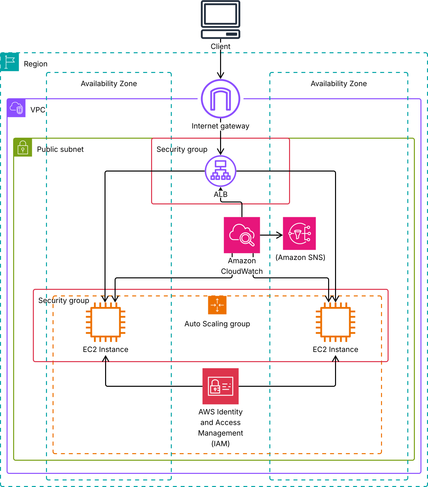

## AWS Graduation Project – Scalable Web Application with ALB & ASG

### 📌 Project Overview
This project demonstrates how to deploy a highly available and scalable web application on AWS using:
- Amazon EC2 (with Apache Web Server)
- Application Load Balancer (ALB)
- Auto Scaling Group (ASG)
- Security Groups
- CloudWatch & SNS for monitoring/alerts
- IAM roles for secure access

### 🏗️ Architecture

### 🌐 Live Demo
Application Load Balancer DNS:  
http://alb-grad-2029923648.eu-north-1.elb.amazonaws.com

Example output in browser:  
`Hello from Auto Scaling Group - ip-10-0-28-107.eu-north-1.compute.internal`

### ⚙️ Deployment Steps
1. **VPC & Subnets** – created public subnets with auto-assign public IP.  
2. **Security Groups** –  
   - ALB-SG → allow inbound HTTP (80) from 0.0.0.0/0  
   - App-SG → allow inbound HTTP (80) only from ALB-SG  
3. **EC2 Launch Template** – bootstrap script installs Apache.  
4. **Auto Scaling Group** – min 2 instances across AZs, attached to ALB.  
5. **Application Load Balancer** – internet-facing, routes traffic to target group.  
6. **IAM Role** – attached to EC2 for secure access to AWS services.  
7. **Monitoring** –  
   - CloudWatch Alarm: CPUUtilization ≥ 70% (triggers SNS email)  
   - CloudWatch Alarm: ALB 5xx errors ≥ 1 (triggers SNS email)  
   - SNS Topic: `grad-alerts` (subscribed email notifications).  

### 📚 Learning Outcomes
- Launching scalable web applications with EC2, ALB, and ASG.  
- Setting up monitoring and notifications with CloudWatch & SNS.  
- Using IAM for secure role-based access.  
